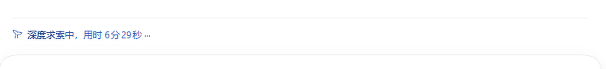

# dsh-turn-status-text

English | [中文](README.md)

Replaces the **"Deep diving for 12s ···"** line in the DSH (DeepSeek Harness) chat area with text you write yourself and a colour you pick,
from **Settings → Plugins → Configurable** — save and it applies immediately, no page reload.

| Default | Customised |
| --- | --- |
|  |  |

Both images are real screenshots from the same machine: the left is the deployment as shipped (`深度求索中，用时 6分29秒 ···`),
the right swaps the text for `硬邦邦思考中…` and the colour for `#ff5500` (the whale mark on the left and the shimmer on the right change colour with it).

## What you can change

| What | Details |
| --- | --- |
| Text | Any text. Include the `{duration}` placeholder to keep the live elapsed time, e.g. `Thinking hard… {duration}` → `Thinking hard… 12s`; without the placeholder the line shows nothing but your text. |
| Colour | Pick one from the swatch or type `#4d6bfe` / `#abc` (the `#` is optional). The whole row takes the colour — the text, the whale mark to its left, and the text's shimmer gradient all follow (see below for why). |
| Reset to default | One control per field: clear the draft and save, and the text goes back to the copy the deployment ships while the colour goes back to the theme colour. |

Changes are stored in the `turn-status-text:` section of `$DSH_HOME/settings.yaml`, so they survive a browser switch and a restart;
the plugin makes no network calls and registers nothing the model can see.

Only the **in-progress line** changes. The `Completed in …` summary after a turn finishes, `Failed`, and the rest stay exactly as shipped.

## Install

From GitHub (the repository ships the built `lib/` and **deliberately declares no `prepare` script**, so pnpm will not ask you to approve build permissions):

```bash
dsh plugin --profile <your profile> add github:WONGIII/dsh-turn-status-text
```

From a local checkout:

```bash
git clone https://github.com/WONGIII/dsh-turn-status-text.git
dsh plugin --profile <your profile> add ./dsh-turn-status-text
```

On the desktop app you can also paste that GitHub URL straight into the **Plugins** page in the sidebar.

> Replace `<your profile>` with your own profile name (commonly `web` for `dsh web`).
> The desktop app's own profile is managed exclusively by the Electron application — the CLI refuses it with
> `profile "desktop" is managed exclusively by the Electron application` — so install and uninstall from the sidebar
> **Plugins** page there.

**DSH has to be restarted once after installing** (`dsh web` or the desktop app). The plugin row is a host-side Loader row, and the browser half is served from it;
only a fresh composition of the configuration mounts a new Loader row — refreshing the page is not enough.
(The configuration file itself is "live" at runtime, but the settings namespace directory a **new** row depends on only includes it after that recomposition.)

Once installed, `@dsh-external/dsh-turn-status-text` shows up in the sidebar under **Plugins → Installed**; expand it to toggle the `dsh-turn-status-text` row on its own.

Uninstall:

```bash
dsh plugin --profile <your profile> remove @dsh-external/dsh-turn-status-text
```

## How to configure

**1. The GUI (recommended)**: Settings → **Plugins** → **Configurable** → expand the **Status text** card.

The card matches the plugin cards the deployment ships: same border/radius/background layers, same font sizes and spacing, same hover and focus-visible states, a header that collapses and **remembers its collapsed state**;
the copy — `Show settings` / `Hide settings`, `Discard`, `Overridden`, `Reset to default`, `This deployment stores settings read-only.` — comes from the platform's own dictionary, and the icons and the `Tag` component are the platform's too (`@deepseek-ai/dsh-client-ui-primitives`).

At the bottom the card has a **Preview** line that renders the current draft text and colour; an invalid colour (say `#12345`) is flagged in red and disables saving.

**2. Temporary override (DevTools console, current page only, wins over the settings)**:

```js
window.__DSH_TURN_STATUS_TEXT__  = 'Thinking hard… {duration}'
window.__DSH_TURN_STATUS_COLOR__ = '#ff5500'
delete window.__DSH_TURN_STATUS_TEXT__      // drop the text override
delete window.__DSH_TURN_STATUS_COLOR__     // drop the colour override
```

Both globals are **read live on every render and on every stylesheet change**, so an edit shows up at once.

Precedence: `window override` > `value from settings` > the copy / theme colour the deployment ships.

## How it works

### Text: the dictionaries stay untouched, the `translate` seam is rewritten

The in-progress line's copy comes from Chat's dictionary keys:

```js
const label = startTime === undefined
  ? t('chat.deepDiving')                                  // Deep diving
  : t('chat.deepDivingFor', { duration })                 // Deep diving for {duration} ···
```

The `t` the framework hands every slot component is built by `ctx.locale.bind(ns)` and implemented as `(key, params) => this.translate(ns, key, params)` —
**`this.translate` is resolved at call time**. So the plugin installs an own property of the same name on the locale service instance to shadow `translate`:
it intercepts exactly these three keys (`chat.deepDiving`, `chat.deepDivingFor`, and `message.turnProcess.deepDivingFor` on 0.1.7),
and forwards every other key untouched (`common` fallbacks, parameter interpolation, unknown keys falling back to the key name); uninstalling the plugin restores the original.

`{duration}` is filled in by the plugin itself from the elapsed-time string the framework passes; when there is no duration parameter (the key used before the clock starts, for instance)
the placeholder is swallowed and doubled spaces are collapsed, so no curly braces ever leak through.

### Colour: one higher-priority rule plus `currentColor`

That line is not flat text painted with `color` — it is `TextShimmer`: a gradient generated from `currentColor` and clipped to the glyphs with
`background-clip: text` + `-webkit-text-fill-color: transparent`. So **pinning down the row's `color` is enough for the shimmer to repaint itself in the new colour**,
with its geometry, animation and timing all left as they were.

This is the single rule the plugin injects (the selector is written twice = 0,2,0, which outranks the generated class at 0,1,0 no matter which stylesheet comes first):

```css
[data-chat-running][data-chat-running]{
  color:#ff5500;
  --dsw-alias-label-deep-diving:#ff5500;   /* the two variables the deployment uses are recoloured too */
  --dsw-alias-label-shimmer:#ff5500;
}
[data-turn-process][data-turn-process]{color:#ff5500}   /* the 0.1.7 turn-process row */
```

The row itself is addressed through **attributes** (`data-chat-running` / `data-turn-process`), never through content-hashed class names that move with the build.
On older deployments (before 0.1.7) that row is `.<hash>_turnStatus` with a gradient background, so the plugin discovers the real class name in `document.styleSheets`
with `/\.([A-Za-z0-9_-]*_turnStatus)(?![\w-])/` and rebuilds a rule with the same gradient geometry;
the `<style>` element carries `data-plugin-css="dsh-turn-status-text"` and is removed on uninstall. With the colour left empty the rule's text is the empty string, which leaves the deployment's styles completely alone.

### The settings card

The host half registers the settings namespace `turn-status-text` (schemastery: `text` and `color`, both defaulting to the empty string = inherit the shipped copy / theme colour);
the browser half registers a card under the same key into the `settings.plugin.item` slot — the Web Plugins page's `Configurable` tab dispatches that slot once per namespace the host serves,
which is the extension point the platform provides for plugins from outside the repository.

The write contract is the platform's: `edit(field, text)` stages a draft, `resetField(field)` stages a clear, `discard()` drops the drafts, `save()` commits them;
saving goes through `scope.mutate([...ops])` as **one atomic write** (editing both fields still writes once), and an implementation without `mutate` falls back to `set`/`unset`.
The post-save check reads the **user layer**, not the resolved value: after an `unset` the host re-resolves that section from the schema defaults,
so "the colour was cleared" appears as the field being absent from `user` and present as its default in `value` — testing `value === undefined` would misreport a clear as a failed save.
Colours are normalized to lowercase `#rrggbb` on save.

The card's styles use theme alias tokens only (`--dsw-alias-bg-layer-2/3`, `--dsw-alias-label-primary/secondary/tertiary`,
`--dsw-alias-border-l2/l4`, `--dsw-alias-label-error`, `--dsw-alias-brand-primary`, `--dsw-alias-label-dimmed`),
with no hard-coded colour anywhere; light/dark switching is left to the theme.
(A trap we hit: the name `--dsw-alias-bg-layer` **does not exist** — write it and everything falls back to the dark fallback value, which in the light theme is a black input box.)

## Layout

```
dsh-turn-status-text/
├── package.json          # dsh.bundle.patch / dsh.client.platform = web; exports["./client"] → the browser bundle
├── cordis.patch.yml      # bundle layer: inserts one dsh-turn-status-text row
├── lib/
│   ├── host.js           # host half: registers the settings namespace turn-status-text (text + color)
│   ├── index.js          # package entry (package.json main): re-exports ./host.js
│   └── client.js         # browser half: rewrites the copy + colours the row + the settings card
├── tools/
│   ├── selfcheck.mjs     # headless self-check (fake DOM + fake LocaleRuntime/SettingsScope running the real bundle)
│   ├── verify-live.mjs   # queries/writes the settings namespace of a running instance
│   ├── live-probe.mjs    # dependency-free CDP probe: reads the status line's text and computed colour in a real page, can screenshot
│   ├── preview.mjs       # renders a card reference page (light/dark)
│   └── hmr-probe.mjs     # listens for hot-reload frames on /plugins/events
├── docs/                 # the captured screenshots used by the README
└── README.md / README.en.md / LICENSE
```

The browser half needs no `node_modules` at all: it `require("react")` / `require("react/jsx-runtime")` through the page's module table.
The host half imports only `@deepseek-ai/schemastery` (declared as a regular dependency; the harness ships 3.18.4 itself).

## Development and verification

```bash
# 1) Browser-half self-check: fake DOM + the production semantics of LocaleRuntime/SettingsScope running the real bundle
node tools/selfcheck.mjs
node tools/selfcheck.mjs <copy of the client.js the server serves>   # check the exact bytes that ship

# 2) Confirm a running instance serves the settings namespace (so the card gets dispatched)
node tools/verify-live.mjs
node tools/verify-live.mjs --set "Thinking hard… {duration}"
node tools/verify-live.mjs --color "#ff5500"
node tools/verify-live.mjs --color -        # clear the colour
node tools/verify-live.mjs --clear          # clear both fields

# 3) Read the status line in a real page (no third-party dependencies; signs the cookie itself and drives headless Chromium)
node tools/live-probe.mjs --wait 30 --shot probe.png

# 4) Generate the card reference page (light/dark)
node tools/preview.mjs && start tools/preview.html

# 5) Watch browser-side hot-reload frames
node tools/hmr-probe.mjs 15
```

`selfcheck.mjs` covers: text precedence (including `{duration}` filling and "swallow the placeholder when there is nothing to fill it with"), non-target keys forwarded untouched,
colour normalization (`#ABC` → `#aabbcc`, `4d6bfe` → `#4d6bfe`, `red`/`#12345` rejected),
the **exact CSS text** of both attribute selectors and of the legacy `_turnStatus` gradient rule, the page-global overrides and their fallback,
an invalid colour disabling save without writing anything, `Reset to default` clearing a field, both fields written in one atomic operation, and the style element being removed after cleanup.

`verify-live.mjs` signs a loopback page cookie with the browser-session secret from the local `$DSH_HOME/.credentials.yaml`,
then calls `settings/describe` / `settings/mutate` (the secret is never printed).

`live-probe.mjs` signs the same cookie, then launches the headless Chromium under `%LOCALAPPDATA%\ms-playwright\chromium-*`
and uses CDP (Node's built-in `WebSocket`) to read `[data-chat-running]`'s text and computed colour. Note that the Web app **has no URL routing**:
a freshly opened tab always lands in the empty state, so the probe only finds the status line when the running turn is already open on the page —
it only reads and never clicks, and when it finds nothing it prints a diagnostic JSON (including the page's currently visible text) and exits with 1.

### Captured live readings on this machine

On the DSH desktop app (0.2.0-rc.2), `live-probe.mjs` reading a real in-flight session:

```
# deployment as shipped (no override set)
{"found":true,"rows":1,"rowClass":"xz4KEq_running","text":"深度求索中深度求索中，用时 6分29秒 ···",
 "rowColor":"color(srgb 0.20549 0.367451 0.730196)",
 "deepDivingVar":"color-mix(in srgb, #4176e6 70%, #172554)",
 "shimmerVar":"color-mix(in srgb, #4176e6 30%, #172554)",
 "ruleInjected":["…","dsh-turn-status-text/card","…"]}

# after the plugin's page globals are turned on
{"found":true,"rows":1,"rowClass":"xz4KEq_running","text":"硬邦邦思考中…硬邦邦思考中…",
 "rowColor":"rgb(255, 85, 0)",
 "deepDivingVar":"#ff5500","shimmerVar":"#ff5500",
 "ruleInjected":["…","dsh-turn-status-text","dsh-turn-status-text/card","…"]}
```

In the first line's text the leading half is the `aria-live` announcement (the same key) and the trailing half is the visible row;
the two readings correspond to `docs/before.png` and `docs/after.png`.

## Compatibility

| Deployment | Copy keys | Colour anchor | Supported |
| --- | --- | --- | --- |
| 0.2.0-rc (current desktop app) | `chat.deepDiving` / `chat.deepDivingFor` | `[data-chat-running]` | ✅ verified live |
| 0.1.7-rc | `message.turnProcess.deepDivingFor` | `[data-turn-process]` | ✅ |
| before 0.1.7 | `chat.deepDiving` | `.<hash>_turnStatus` (discovered at runtime) | ✅ |

The host half depends on `@deepseek-ai/schemastery@^3.18.4` (the harness ships the same version); it declares no `prepare`, so a git install needs no build-script approval.

## Limitations

- Only the in-progress line changes; the copy on the summary line after a turn ends (`message.turnProcess.took` and friends) is out of scope.
- The colour applies to the **whole row** (whale mark included), because it is that row's `color`; there is no separate whale switch.
- Content-hashed class names only need discovering on the legacy path, so a very old deployment that renamed `_turnStatus` gets no colour (the text override still works).
- Placeholders other than `{duration}` are rendered verbatim.

## License

[MIT](LICENSE) © 2026 WONGIII
